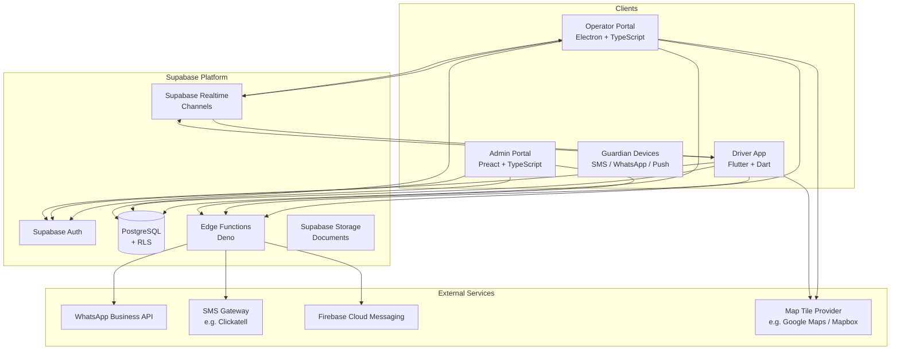
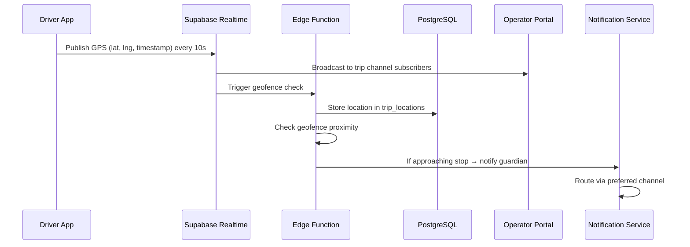
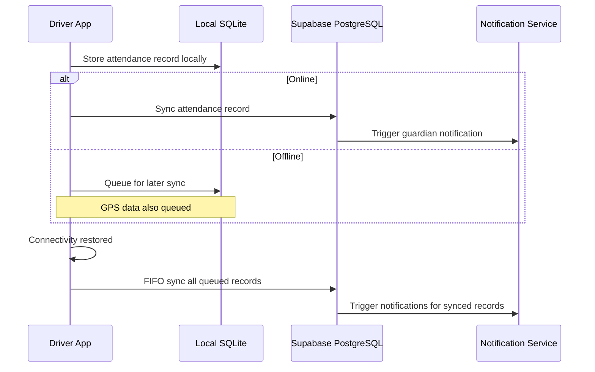

# Design Document: Phoenix School Transport Management

## Overview

Phoenix School Transport Management extends the existing Phoenix multi-tenant SaaS platform to serve South African school transport operators. The system manages school bus routes, real-time vehicle tracking, student attendance at stops, guardian notifications (SMS, push, WhatsApp), billing, and offline-capable driver operations.

The design leverages the established Phoenix architecture:
- **Supabase** (PostgreSQL + Edge Functions + Realtime + Auth) as the backend
- **Electron desktop app** (TypeScript) as the Operator Portal
- **Flutter mobile app** (Dart, BLoC state management) as the Driver App
- **Preact admin portal** (TypeScript, Vite) as the Vendor/Platform Admin

Key design decisions:
- Reuse the existing `tenants`, `users`, and RLS patterns already in place
- Extend the role system to include `operator` and `driver` roles alongside the existing `admin` and `staff`
- Use Supabase Realtime channels for GPS location broadcasting
- Use SQLite on the Driver App for offline attendance and GPS queuing (already in the Flutter stack via `sqflite`)
- Integrate WhatsApp Business API via a dedicated Edge Function gateway

## Architecture

### High-Level System Architecture



### Data Flow: GPS Tracking



### Data Flow: Attendance Recording (Offline-Capable)



## Components and Interfaces

### 1. Supabase Edge Functions (API Layer)

| Function | Purpose | Auth |
|----------|---------|------|
| `provision-transport-tenant` | Create new transport tenant workspace | vendor_admin |
| `manage-vehicles` | CRUD vehicles with compliance checks | operator |
| `manage-routes` | CRUD routes and stops | operator |
| `manage-schedules` | CRUD schedules, generate trips | operator |
| `manage-students` | CRUD students, assign to routes/stops | operator |
| `start-trip` | Mark trip as in-progress, begin tracking | driver |
| `end-trip` | Mark trip completed, stop tracking | driver |
| `record-attendance` | Record student board/absent status | driver |
| `sync-offline-data` | Batch sync attendance + GPS from offline queue | driver |
| `generate-invoice` | Generate monthly invoices per student | operator |
| `record-payment` | Record payment against invoice | operator |
| `send-notification` | Route notification via preferred channel | system |
| `whatsapp-webhook` | Receive inbound WhatsApp messages | system |
| `whatsapp-send` | Send outbound WhatsApp template messages | system |
| `generate-transport-report` | Generate trip/attendance/revenue reports | operator |
| `check-geofence` | Evaluate vehicle position against stop geofences | system |

### 2. Supabase Realtime Channels

| Channel Pattern | Purpose | Publishers | Subscribers |
|----------------|---------|-----------|------------|
| `trip:{trip_id}:location` | Live GPS updates for a trip | Driver App | Operator Portal |
| `tenant:{tenant_id}:alerts` | Operational alerts (deviation, signal loss) | Edge Functions | Operator Portal |
| `trip:{trip_id}:attendance` | Real-time attendance updates | Edge Functions | Operator Portal |

### 3. Operator Portal Components (Electron)

| Module | Responsibility |
|--------|---------------|
| `VehicleManager` | Fleet CRUD, compliance monitoring |
| `RouteEditor` | Route/stop CRUD with interactive map |
| `ScheduleManager` | Schedule CRUD, trip calendar view |
| `StudentManager` | Student registration, route assignment |
| `LiveTrackingMap` | Real-time vehicle positions on map |
| `BillingModule` | Invoice generation, payment recording |
| `ReportViewer` | Report generation, export (CSV/PDF) |
| `AuditLogViewer` | Filterable audit log display |

### 4. Driver App Components (Flutter)

| Module | Responsibility |
|--------|---------------|
| `TripListScreen` | Display day's trips chronologically |
| `ActiveTripScreen` | Navigation, attendance marking at stops |
| `AttendanceSheet` | Student list per stop with board/absent toggle |
| `GPSService` | Background location tracking + queuing |
| `OfflineSyncService` | SQLite queue management, FIFO sync |
| `ConnectivityMonitor` | Network state detection, sync triggers |

### 5. Notification Service Interface

```typescript
interface NotificationPayload {
  tenant_id: string;
  recipient_guardian_id: string;
  notification_type: 'approaching' | 'boarded' | 'dropped_off' | 'delay' | 'trip_cancelled' | 'absent' | 'invoice' | 'payment_reminder';
  template_params: Record<string, string>;
  preferred_channel?: 'sms' | 'push' | 'whatsapp';
}

interface NotificationResult {
  success: boolean;
  channel_used: 'sms' | 'push' | 'whatsapp';
  message_id: string;
  fallback_used: boolean;
  error?: string;
}
```

### 6. WhatsApp Gateway Interface

```typescript
interface WhatsAppMessage {
  to: string; // E.164 phone number
  template_name: string;
  template_params: string[];
  language_code: string; // 'en' or 'af'
}

interface WhatsAppInbound {
  from: string;
  message_body: string;
  timestamp: string;
  message_id: string;
}
```

## Data Models

### Entity Relationship Diagram

```mermaid
erDiagram
    tenants ||--o{ vehicles : owns
    tenants ||--o{ routes : owns
    tenants ||--o{ users : has
    tenants ||--o{ students : has
    tenants ||--o{ schedules : has

    routes ||--o{ stops : contains
    routes ||--o{ schedules : scheduled_on
    routes ||--o{ student_route_assignments : assigned

    schedules ||--o{ trips : generates
    schedules ||--|| vehicles : uses
    schedules ||--|| users : driven_by

    trips ||--o{ attendance_records : logs
    trips ||--o{ trip_locations : tracked

    students ||--o{ student_route_assignments : assigned
    students ||--o{ guardians : has
    students ||--o{ attendance_records : recorded

    guardians ||--o{ notifications : receives
    guardians ||--o{ invoices : billed

    stops ||--o{ student_route_assignments : pickup_at

    invoices ||--o{ payments : settled_by
```



### Database Schema

#### Transport-Specific Tables

```sql
-- =============================================================================
-- VEHICLES TABLE
-- =============================================================================
CREATE TABLE transport_vehicles (
    id UUID PRIMARY KEY DEFAULT gen_random_uuid(),
    tenant_id UUID NOT NULL REFERENCES tenants(id),
    registration_number TEXT NOT NULL,
    make TEXT NOT NULL,
    model TEXT NOT NULL,
    year INTEGER NOT NULL CHECK (year BETWEEN 1990 AND 2100),
    seating_capacity INTEGER NOT NULL CHECK (seating_capacity BETWEEN 1 AND 100),
    compliance_certificate_expiry DATE NOT NULL,
    status TEXT NOT NULL DEFAULT 'available' CHECK (status IN ('available', 'assigned', 'maintenance', 'decommissioned')),
    created_at TIMESTAMPTZ DEFAULT now(),
    updated_at TIMESTAMPTZ DEFAULT now(),
    UNIQUE (tenant_id, registration_number)
);

-- =============================================================================
-- ROUTES TABLE
-- =============================================================================
CREATE TABLE transport_routes (
    id UUID PRIMARY KEY DEFAULT gen_random_uuid(),
    tenant_id UUID NOT NULL REFERENCES tenants(id),
    route_name TEXT NOT NULL,
    school_name TEXT NOT NULL,
    estimated_travel_minutes INTEGER NOT NULL CHECK (estimated_travel_minutes > 0),
    monthly_fee NUMERIC(10, 2) NOT NULL DEFAULT 0.00,
    is_active BOOLEAN DEFAULT true,
    created_at TIMESTAMPTZ DEFAULT now(),
    updated_at TIMESTAMPTZ DEFAULT now()
);

-- =============================================================================
-- STOPS TABLE
-- =============================================================================
CREATE TABLE transport_stops (
    id UUID PRIMARY KEY DEFAULT gen_random_uuid(),
    route_id UUID NOT NULL REFERENCES transport_routes(id) ON DELETE CASCADE,
    tenant_id UUID NOT NULL REFERENCES tenants(id),
    stop_name TEXT NOT NULL,
    latitude DOUBLE PRECISION NOT NULL CHECK (latitude BETWEEN -90 AND 90),
    longitude DOUBLE PRECISION NOT NULL CHECK (longitude BETWEEN -180 AND 180),
    geofence_radius_meters INTEGER NOT NULL DEFAULT 100 CHECK (geofence_radius_meters BETWEEN 10 AND 5000),
    stop_order INTEGER NOT NULL CHECK (stop_order > 0),
    created_at TIMESTAMPTZ DEFAULT now(),
    UNIQUE (route_id, stop_order)
);

-- =============================================================================
-- STUDENTS TABLE
-- =============================================================================
CREATE TABLE transport_students (
    id UUID PRIMARY KEY DEFAULT gen_random_uuid(),
    tenant_id UUID NOT NULL REFERENCES tenants(id),
    full_name TEXT NOT NULL,
    grade TEXT NOT NULL,
    school_name TEXT NOT NULL,
    assigned_route_id UUID REFERENCES transport_routes(id),
    assigned_stop_id UUID REFERENCES transport_stops(id),
    status TEXT NOT NULL DEFAULT 'active' CHECK (status IN ('active', 'suspended', 'removed')),
    created_at TIMESTAMPTZ DEFAULT now(),
    updated_at TIMESTAMPTZ DEFAULT now()
);

-- =============================================================================
-- GUARDIANS TABLE
-- =============================================================================
CREATE TABLE transport_guardians (
    id UUID PRIMARY KEY DEFAULT gen_random_uuid(),
    tenant_id UUID NOT NULL REFERENCES tenants(id),
    full_name TEXT NOT NULL,
    phone_number TEXT NOT NULL,
    whatsapp_number TEXT,
    email TEXT,
    preferred_notification_channel TEXT NOT NULL DEFAULT 'sms' CHECK (preferred_notification_channel IN ('sms', 'push', 'whatsapp')),
    push_token TEXT,
    created_at TIMESTAMPTZ DEFAULT now()
);

-- =============================================================================
-- STUDENT-GUARDIAN JUNCTION TABLE
-- =============================================================================
CREATE TABLE transport_student_guardians (
    student_id UUID NOT NULL REFERENCES transport_students(id) ON DELETE CASCADE,
    guardian_id UUID NOT NULL REFERENCES transport_guardians(id) ON DELETE CASCADE,
    relationship TEXT NOT NULL DEFAULT 'parent',
    is_primary BOOLEAN DEFAULT false,
    PRIMARY KEY (student_id, guardian_id)
);

-- =============================================================================
-- SCHEDULES TABLE
-- =============================================================================
CREATE TABLE transport_schedules (
    id UUID PRIMARY KEY DEFAULT gen_random_uuid(),
    tenant_id UUID NOT NULL REFERENCES tenants(id),
    route_id UUID NOT NULL REFERENCES transport_routes(id),
    vehicle_id UUID NOT NULL REFERENCES transport_vehicles(id),
    driver_id UUID NOT NULL REFERENCES users(id),
    trip_type TEXT NOT NULL CHECK (trip_type IN ('morning_pickup', 'afternoon_dropoff')),
    departure_time TIME NOT NULL,
    active_days TEXT[] NOT NULL DEFAULT '{}', -- e.g. {'mon','tue','wed','thu','fri'}
    is_active BOOLEAN DEFAULT true,
    created_at TIMESTAMPTZ DEFAULT now(),
    updated_at TIMESTAMPTZ DEFAULT now()
);

-- =============================================================================
-- TRIPS TABLE
-- =============================================================================
CREATE TABLE transport_trips (
    id UUID PRIMARY KEY DEFAULT gen_random_uuid(),
    tenant_id UUID NOT NULL REFERENCES tenants(id),
    schedule_id UUID NOT NULL REFERENCES transport_schedules(id),
    route_id UUID NOT NULL REFERENCES transport_routes(id),
    vehicle_id UUID NOT NULL REFERENCES transport_vehicles(id),
    driver_id UUID NOT NULL REFERENCES users(id),
    trip_date DATE NOT NULL,
    trip_type TEXT NOT NULL CHECK (trip_type IN ('morning_pickup', 'afternoon_dropoff')),
    scheduled_departure TIME NOT NULL,
    actual_departure TIMESTAMPTZ,
    actual_completion TIMESTAMPTZ,
    status TEXT NOT NULL DEFAULT 'scheduled' CHECK (status IN ('scheduled', 'in_progress', 'completed', 'cancelled')),
    cancellation_reason TEXT,
    created_at TIMESTAMPTZ DEFAULT now(),
    UNIQUE (schedule_id, trip_date)
);

-- =============================================================================
-- ATTENDANCE RECORDS TABLE
-- =============================================================================
CREATE TABLE transport_attendance (
    id UUID PRIMARY KEY DEFAULT gen_random_uuid(),
    tenant_id UUID NOT NULL REFERENCES tenants(id),
    trip_id UUID NOT NULL REFERENCES transport_trips(id),
    student_id UUID NOT NULL REFERENCES transport_students(id),
    stop_id UUID NOT NULL REFERENCES transport_stops(id),
    status TEXT NOT NULL CHECK (status IN ('boarded', 'absent', 'dropped_off')),
    recorded_at TIMESTAMPTZ NOT NULL DEFAULT now(),
    latitude DOUBLE PRECISION,
    longitude DOUBLE PRECISION,
    synced_from_offline BOOLEAN DEFAULT false,
    created_at TIMESTAMPTZ DEFAULT now(),
    UNIQUE (trip_id, student_id, status)
);

-- =============================================================================
-- TRIP LOCATIONS TABLE (GPS tracking history)
-- =============================================================================
CREATE TABLE transport_trip_locations (
    id UUID PRIMARY KEY DEFAULT gen_random_uuid(),
    trip_id UUID NOT NULL REFERENCES transport_trips(id),
    tenant_id UUID NOT NULL REFERENCES tenants(id),
    latitude DOUBLE PRECISION NOT NULL,
    longitude DOUBLE PRECISION NOT NULL,
    recorded_at TIMESTAMPTZ NOT NULL,
    speed_kmh NUMERIC(5, 1),
    heading NUMERIC(5, 1),
    synced_from_offline BOOLEAN DEFAULT false
);

-- =============================================================================
-- INVOICES TABLE
-- =============================================================================
CREATE TABLE transport_invoices (
    id UUID PRIMARY KEY DEFAULT gen_random_uuid(),
    tenant_id UUID NOT NULL REFERENCES tenants(id),
    student_id UUID NOT NULL REFERENCES transport_students(id),
    guardian_id UUID NOT NULL REFERENCES transport_guardians(id),
    invoice_number TEXT NOT NULL,
    billing_month DATE NOT NULL, -- first of month
    amount NUMERIC(10, 2) NOT NULL CHECK (amount > 0),
    status TEXT NOT NULL DEFAULT 'pending' CHECK (status IN ('pending', 'paid', 'overdue', 'cancelled')),
    due_date DATE NOT NULL,
    sent_at TIMESTAMPTZ,
    created_at TIMESTAMPTZ DEFAULT now(),
    UNIQUE (tenant_id, invoice_number)
);

-- =============================================================================
-- TRANSPORT PAYMENTS TABLE
-- =============================================================================
CREATE TABLE transport_payments (
    id UUID PRIMARY KEY DEFAULT gen_random_uuid(),
    tenant_id UUID NOT NULL REFERENCES tenants(id),
    invoice_id UUID NOT NULL REFERENCES transport_invoices(id),
    amount NUMERIC(10, 2) NOT NULL CHECK (amount > 0),
    payment_method TEXT NOT NULL CHECK (payment_method IN ('eft', 'cash', 'card', 'debit_order')),
    payment_date DATE NOT NULL DEFAULT CURRENT_DATE,
    reference TEXT,
    created_at TIMESTAMPTZ DEFAULT now()
);

-- =============================================================================
-- NOTIFICATIONS LOG TABLE
-- =============================================================================
CREATE TABLE transport_notifications (
    id UUID PRIMARY KEY DEFAULT gen_random_uuid(),
    tenant_id UUID NOT NULL REFERENCES tenants(id),
    guardian_id UUID NOT NULL REFERENCES transport_guardians(id),
    notification_type TEXT NOT NULL,
    channel TEXT NOT NULL CHECK (channel IN ('sms', 'push', 'whatsapp')),
    template_name TEXT,
    template_params JSONB,
    delivery_status TEXT NOT NULL DEFAULT 'pending' CHECK (delivery_status IN ('pending', 'sent', 'delivered', 'failed')),
    retry_count INTEGER DEFAULT 0,
    fallback_used BOOLEAN DEFAULT false,
    external_message_id TEXT,
    sent_at TIMESTAMPTZ,
    created_at TIMESTAMPTZ DEFAULT now()
);

-- =============================================================================
-- WHATSAPP MESSAGES LOG
-- =============================================================================
CREATE TABLE transport_whatsapp_messages (
    id UUID PRIMARY KEY DEFAULT gen_random_uuid(),
    tenant_id UUID NOT NULL REFERENCES tenants(id),
    direction TEXT NOT NULL CHECK (direction IN ('inbound', 'outbound')),
    phone_number TEXT NOT NULL,
    template_name TEXT,
    message_body TEXT,
    delivery_status TEXT DEFAULT 'pending' CHECK (delivery_status IN ('pending', 'sent', 'delivered', 'read', 'failed')),
    external_message_id TEXT,
    guardian_id UUID REFERENCES transport_guardians(id),
    created_at TIMESTAMPTZ DEFAULT now()
);

-- =============================================================================
-- SCHOOL CLOSURES / HOLIDAYS TABLE
-- =============================================================================
CREATE TABLE transport_school_closures (
    id UUID PRIMARY KEY DEFAULT gen_random_uuid(),
    tenant_id UUID NOT NULL REFERENCES tenants(id),
    closure_date DATE NOT NULL,
    reason TEXT NOT NULL,
    created_at TIMESTAMPTZ DEFAULT now(),
    UNIQUE (tenant_id, closure_date)
);

-- =============================================================================
-- AUDIT LOG TABLE (transport-specific events)
-- =============================================================================
CREATE TABLE transport_audit_log (
    id UUID PRIMARY KEY DEFAULT gen_random_uuid(),
    tenant_id UUID NOT NULL REFERENCES tenants(id),
    user_id UUID REFERENCES users(id),
    event_type TEXT NOT NULL,
    entity_type TEXT NOT NULL,
    entity_id UUID,
    details JSONB,
    ip_address INET,
    created_at TIMESTAMPTZ DEFAULT now()
);

-- =============================================================================
-- INDEXES
-- =============================================================================
CREATE INDEX idx_transport_vehicles_tenant ON transport_vehicles(tenant_id);
CREATE INDEX idx_transport_routes_tenant ON transport_routes(tenant_id);
CREATE INDEX idx_transport_stops_route ON transport_stops(route_id);
CREATE INDEX idx_transport_students_tenant ON transport_students(tenant_id);
CREATE INDEX idx_transport_students_route ON transport_students(assigned_route_id);
CREATE INDEX idx_transport_schedules_tenant ON transport_schedules(tenant_id);
CREATE INDEX idx_transport_trips_tenant_date ON transport_trips(tenant_id, trip_date);
CREATE INDEX idx_transport_trips_driver_date ON transport_trips(driver_id, trip_date);
CREATE INDEX idx_transport_trips_status ON transport_trips(status);
CREATE INDEX idx_transport_attendance_trip ON transport_attendance(trip_id);
CREATE INDEX idx_transport_attendance_student ON transport_attendance(student_id);
CREATE INDEX idx_transport_trip_locations_trip ON transport_trip_locations(trip_id);
CREATE INDEX idx_transport_trip_locations_time ON transport_trip_locations(trip_id, recorded_at);
CREATE INDEX idx_transport_invoices_tenant_month ON transport_invoices(tenant_id, billing_month);
CREATE INDEX idx_transport_invoices_guardian ON transport_invoices(guardian_id);
CREATE INDEX idx_transport_invoices_status ON transport_invoices(status);
CREATE INDEX idx_transport_notifications_guardian ON transport_notifications(guardian_id);
CREATE INDEX idx_transport_audit_tenant_time ON transport_audit_log(tenant_id, created_at);
CREATE INDEX idx_transport_audit_event ON transport_audit_log(tenant_id, event_type);
```

### Row-Level Security Strategy

All transport tables follow the established pattern with `tenant_id` column and RLS policies:

```sql
-- Example RLS policy pattern (applied to all transport_ tables)
ALTER TABLE transport_vehicles ENABLE ROW LEVEL SECURITY;

CREATE POLICY "tenant_isolation" ON transport_vehicles
    FOR ALL USING (
        tenant_id = (auth.jwt() -> 'user_metadata' ->> 'tenant_id')::uuid
    );

-- Driver sees only trips assigned to them
CREATE POLICY "driver_own_trips" ON transport_trips
    FOR SELECT USING (
        driver_id = auth.uid()
        OR (auth.jwt() -> 'user_metadata' ->> 'role') IN ('operator', 'admin')
    );
```


## Correctness Properties

*A property is a characteristic or behavior that should hold true across all valid executions of a system—essentially, a formal statement about what the system should do. Properties serve as the bridge between human-readable specifications and machine-verifiable correctness guarantees.*

### Property 1: Tenant Data Isolation

*For any* two tenants A and B, and any query executed with tenant A's credentials, the query result shall contain zero rows belonging to tenant B across all transport tables.

**Validates: Requirements 1.3**

### Property 2: Tenant Provisioning Atomicity

*For any* tenant provisioning request that fails at any intermediate step, the database shall contain no partial tenant records, user accounts, or associated resources.

**Validates: Requirements 1.4**

### Property 3: Role-Based Access Denial

*For any* user with a given role attempting to access a resource restricted to a higher-privilege role, the system shall deny the request and create exactly one audit log entry recording the denied attempt.

**Validates: Requirements 2.5**

### Property 4: Vehicle Compliance Blocks Assignment

*For any* vehicle where the compliance_certificate_expiry date is earlier than today, the system shall reject any attempt to assign that vehicle to an active route or schedule.

**Validates: Requirements 3.4**

### Property 5: Vehicle Deletion Protection During Active Trip

*For any* vehicle currently assigned to a trip with status 'in_progress', the system shall reject deletion of that vehicle record.

**Validates: Requirements 3.5**

### Property 6: Compliance Expiry Notification Threshold

*For any* vehicle where compliance_certificate_expiry is between today and today + 30 days (inclusive), the system shall generate an expiry alert notification to the operator. For any vehicle with expiry > 30 days away, no alert shall be generated.

**Validates: Requirements 3.3**

### Property 7: Route Modification Notifies All Assigned Drivers

*For any* route with N assigned drivers (via active schedules), a route modification shall produce exactly N push notifications, one per assigned driver.

**Validates: Requirements 4.5**

### Property 8: Trip Generation Correctness

*For any* active schedule with defined active_days and a given date range, the system shall generate trip instances only for dates that (a) match the schedule's active_days AND (b) do not appear in the school_closures table for that tenant. No trips shall be generated for closure dates or inactive weekdays.

**Validates: Requirements 5.2, 5.3**

### Property 9: Trip Generation Lookahead

*For any* active schedule, the system shall maintain trip instances covering at least 7 calendar days into the future from today.

**Validates: Requirements 5.4**

### Property 10: Driver Trip List Ordering

*For any* set of trips assigned to a driver on a given date, the returned list shall be sorted by scheduled_departure time in ascending order.

**Validates: Requirements 6.1**

### Property 11: Geofence Detection Correctness

*For any* GPS position (lat, lng) and stop with geofence_radius_meters R, the system shall determine the vehicle is within the geofence if and only if the haversine distance between the position and the stop coordinates is less than or equal to R meters.

**Validates: Requirements 6.3**

### Property 12: Route Deviation Detection

*For any* vehicle position during an active trip, if the minimum distance from the vehicle to any point on the planned route polyline exceeds 500 meters, the system shall generate a deviation alert to the operator.

**Validates: Requirements 7.3**

### Property 13: ETA-Based Approaching Notification

*For any* vehicle with an estimated time of arrival at a stop that is ≤ 5 minutes, the system shall trigger an approaching notification for every guardian of every student assigned to that stop.

**Validates: Requirements 8.1**

### Property 14: Delay Notification Trigger

*For any* trip where the actual departure time exceeds the scheduled departure time by more than 10 minutes, the system shall send a delay notification to all guardians of students on that trip's route.

**Validates: Requirements 8.4**

### Property 15: Guardian Preferred Channel Routing

*For any* guardian with a configured preferred_notification_channel, all notifications sent to that guardian shall use that channel (unless fallback is triggered by delivery failure).

**Validates: Requirements 8.6**

### Property 16: Student Registration Requires Guardian

*For any* student registration payload that does not include at least one guardian contact, the system shall reject the registration.

**Validates: Requirements 9.1**

### Property 17: Student-Stop Route Consistency

*For any* student assignment where assigned_stop_id is set, the stop's route_id must equal the student's assigned_route_id. The system shall reject any assignment violating this constraint.

**Validates: Requirements 9.3**

### Property 18: Vehicle Capacity Enforcement

*For any* route with an assigned vehicle of seating_capacity C, the count of active students assigned to that route shall not exceed C. The system shall reject assignments that would breach capacity.

**Validates: Requirements 9.4**

### Property 19: Invoice Amount Matches Route Fee

*For any* active student assigned to a route with monthly_fee F, the generated invoice amount for that student shall equal F.

**Validates: Requirements 10.1**

### Property 20: Payment Updates Invoice Status

*For any* invoice with amount A that receives a payment totalling ≥ A, the invoice status shall transition to 'paid'.

**Validates: Requirements 10.4**

### Property 21: Overdue Invoice Reminder at 14 Days

*For any* invoice where status is not 'paid' and today > due_date + 14 days, the system shall send a payment reminder notification to the guardian.

**Validates: Requirements 10.5**

### Property 22: Overdue Invoice Flagging at 30 Days

*For any* invoice where status is not 'paid' and today > due_date + 30 days, the system shall flag the associated student account and notify the operator.

**Validates: Requirements 10.6**

### Property 23: Attendance Rate Calculation

*For any* set of attendance records in a given month for a student, the attendance rate shall equal (count of records with status 'boarded') / (total expected trips for that student in the month).

**Validates: Requirements 11.2**

### Property 24: Revenue Report Correctness

*For any* set of invoices and payments in a given month for a route, invoiced_total = sum(invoice.amount), collected_total = sum(payment.amount), outstanding = invoiced_total - collected_total.

**Validates: Requirements 11.3**

### Property 25: Offline Sync FIFO Order

*For any* set of locally queued attendance records with timestamps t1 < t2 < ... < tN, the sync operation shall transmit them to the server in the order t1, t2, ..., tN.

**Validates: Requirements 12.2**

### Property 26: Conflict Resolution Last-Write-Wins

*For any* two conflicting records (local timestamp tL, server timestamp tS), the system shall retain the record with max(tL, tS) as the authoritative value.

**Validates: Requirements 12.4**

### Property 27: Suspended Tenant Access Denial

*For any* user belonging to a tenant with subscription_status = 'suspended', all authenticated API requests shall return a 403 Forbidden response.

**Validates: Requirements 13.3**

### Property 28: Audit Log Completeness

*For any* significant system event (authentication, data modification, or trip lifecycle event), the system shall create exactly one audit log entry containing the event_type, user_id, entity_type, entity_id, and timestamp.

**Validates: Requirements 14.1, 14.2, 14.3**

### Property 29: WhatsApp Template Parameter Population

*For any* trip-related WhatsApp notification with parameters (student_name, route_name, eta), the constructed message shall contain all three parameter values in the correct template slots.

**Validates: Requirements 15.3**

### Property 30: WhatsApp Fallback to SMS After 3 Failures

*For any* WhatsApp message that fails delivery after 3 retry attempts, the system shall attempt SMS delivery to the same recipient and log the WhatsApp failure with retry_count = 3 and fallback_used = true.

**Validates: Requirements 15.6**

### Property 31: WhatsApp Message Logging

*For any* sent or received WhatsApp message, the system shall create a corresponding entry in transport_whatsapp_messages with the correct direction, delivery_status, and timestamp.

**Validates: Requirements 15.7**

## Error Handling

### Edge Function Error Responses

All Edge Functions follow a consistent error response format:

```typescript
interface ErrorResponse {
  error: string;        // Human-readable error message
  code: string;         // Machine-readable error code (e.g., 'VEHICLE_EXPIRED')
  details?: unknown;    // Optional additional context
}
```

| Scenario | HTTP Status | Error Code |
|----------|-------------|------------|
| Missing/invalid auth token | 401 | `AUTH_REQUIRED` |
| Insufficient role permissions | 403 | `INSUFFICIENT_ROLE` |
| Tenant suspended | 403 | `TENANT_SUSPENDED` |
| Resource not found | 404 | `NOT_FOUND` |
| Validation failure | 422 | `VALIDATION_ERROR` |
| Vehicle compliance expired | 422 | `VEHICLE_COMPLIANCE_EXPIRED` |
| Route capacity exceeded | 422 | `CAPACITY_EXCEEDED` |
| Stop not on student's route | 422 | `STOP_ROUTE_MISMATCH` |
| Provisioning rollback | 500 | `PROVISIONING_FAILED` |
| WhatsApp delivery failure | 502 | `WHATSAPP_DELIVERY_FAILED` |
| GPS signal timeout | N/A (client) | `GPS_SIGNAL_LOST` |

### Notification Failure Strategy

1. **Primary channel attempt** → preferred_notification_channel
2. **Retry** → up to 3 attempts with exponential backoff (2s, 4s, 8s)
3. **Fallback** → If WhatsApp fails 3x, fall back to SMS. If SMS fails 3x, fall back to push.
4. **Logging** → All attempts logged to transport_notifications with retry_count and fallback_used flag

### Offline Sync Error Handling

1. **Queue persistence** → SQLite records survive app restarts
2. **Sync retry** → Failed syncs are retried on next connectivity restoration
3. **Conflict resolution** → Last-write-wins by timestamp comparison
4. **Data integrity** → Each synced batch is wrapped in a transaction; partial failures roll back the batch

### GPS Tracking Error Handling

| Condition | Action |
|-----------|--------|
| GPS signal lost > 60s | Display warning, log gap in trip_locations |
| GPS signal lost > 120s | Show "signal lost" indicator in Operator Portal |
| Location permission denied | Block trip start, show permission request |
| Battery saver mode | Warn driver that tracking accuracy may be reduced |

## Testing Strategy

### Property-Based Testing (fast-check)

The project already uses `fast-check` (v3.23.2) and `vitest` (v1.6.1) in the desktop-app. Property-based tests will be written for all correctness properties identified above.

**Configuration:**
- Library: `fast-check` (already in devDependencies)
- Runner: `vitest` (already configured)
- Minimum iterations: 100 per property
- Each test tagged with: `Feature: phoenix-school-transport-management, Property {N}: {title}`

**Property tests target pure logic functions:**
- Geofence distance calculation (haversine)
- Trip generation algorithm (schedule → trip instances)
- ETA calculation
- Route deviation detection
- Notification channel routing
- Invoice amount calculation
- Attendance rate aggregation
- Revenue report calculations
- FIFO queue ordering
- Conflict resolution (last-write-wins)
- Capacity enforcement validation
- Compliance date checks

### Unit Tests (Example-Based)

- Vehicle CRUD operations
- Route/stop CRUD operations
- Student registration validation
- Attendance record creation
- Invoice generation flow
- Dashboard metric calculations
- Audit log entry creation

### Integration Tests

- Supabase Auth user creation and role assignment
- RLS policy enforcement across tenants
- Edge Function request/response flows
- Supabase Realtime channel subscription and broadcast
- WhatsApp Business API template message delivery
- Firebase push notification delivery
- Offline sync → server reconciliation

### End-to-End Tests

- Full trip lifecycle: schedule → trip generation → start trip → GPS tracking → geofence → attendance → end trip
- Billing cycle: fee setup → invoice generation → notification → payment → receipt
- Tenant provisioning: registration → workspace creation → admin user → first login

### Test Organisation

```
desktop-app/tests/
├── properties/           # Property-based tests (fast-check)
│   ├── geofence.prop.test.ts
│   ├── trip-generation.prop.test.ts
│   ├── notification-routing.prop.test.ts
│   ├── billing.prop.test.ts
│   ├── capacity.prop.test.ts
│   ├── compliance.prop.test.ts
│   ├── reporting.prop.test.ts
│   ├── offline-sync.prop.test.ts
│   └── audit-logging.prop.test.ts
├── unit/                 # Example-based unit tests
│   ├── vehicle-manager.test.ts
│   ├── route-editor.test.ts
│   ├── student-manager.test.ts
│   └── billing-module.test.ts
└── integration/          # Integration tests
    ├── rls-policies.test.ts
    ├── edge-functions.test.ts
    └── realtime-channels.test.ts
```
